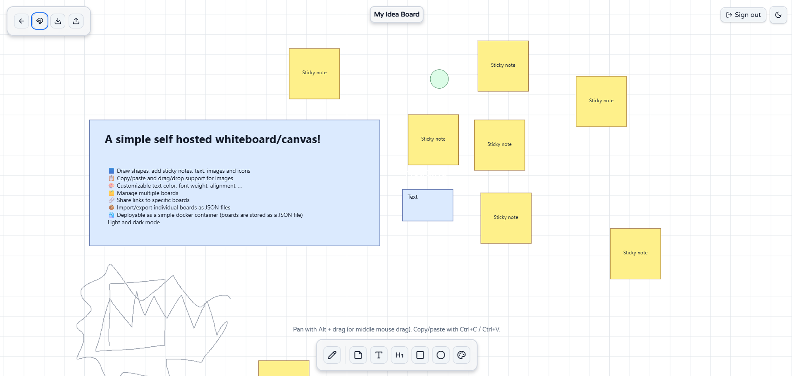

# Simple Whiteboard

Whiteboards with shapes, sticky notes, text, images and icons. Deployable as a simple docker container in your homelab. Includes support for multiple boards and import/export of individual boards.




## ✨ Features

- 🟦 Draw shapes, add sticky notes, text, images and icons
- ✏️ Edit and move elements around the board
- 🖌️ Pencil freeform drawing
- 🖼️ Copy/paste and drag/drop support for images
- 🎨 Customizable text color, font weight, alignment, ...
- 🔗 Linkable elements: add a link to any element and open it in a new tab when clicked
- 🧩 Custom icon browser with 1000+ icons from [lucide icons](https://github.com/lucide-icons/lucide)
- 🗄️ Layer system for easy organization of elements (bring to front/send to back, move up/down)
- ▶️ Embedd YouTube videos by pasting the video URL
- 🗂️ Manage multiple boards
- 🔗 Share links to specific boards
- 📦 Import/export individual boards as JSON files
- 🐳 Deployable as a simple docker container (boards are stored as a JSON file)
- 🔐 Built-in authentication with Better Auth + SQLite
- 🪪 Email/password registration and sign-in
- 🌐 OIDC provider sign-in (configurable via environment)
- Light and dark mode

**Currently does not support:**

- Real time collaboration (not planned for the foreseeable future)

## 🏠 Self-hosting

The recommended way to self-host is using Docker. You can use the provided `docker-compose.yml` file to get started quickly.

```yaml
services:
  whiteboard:
    image: ghcr.io/kellojo/whiteboard:latest
    container_name: whiteboard
    restart: unless-stopped
    ports:
      - "3000:3000"
    environment:
      - BETTER_AUTH_SECRET=replace-with-a-long-random-secret
      - BETTER_AUTH_URL=http://localhost:3000
      - AUTH_ENABLE_EMAIL_PASSWORD=true
    volumes:
      - ./whiteboards:/app/.whiteboards
```

You can generate a secret with:

```sh
npx auth secret
```

> In production, always set a strong `BETTER_AUTH_SECRET` and use HTTPS for `BETTER_AUTH_URL`.

On first startup, auth tables are created automatically in `.whiteboards/auth.sqlite`.

### Optional OIDC providers

Configure one or more OIDC providers via `OIDC_PROVIDERS_JSON`.

```env
OIDC_PROVIDERS_JSON=[{"providerId":"keycloak","name":"Keycloak","discoveryUrl":"https://id.example.com/realms/main/.well-known/openid-configuration","clientId":"whiteboard","clientSecret":"replace-me","scopes":["openid","profile","email"]}]
```

After setting this, users can sign in with those providers on the `/auth/login` and `/auth/signup` pages.

### Optional email/password toggle

Set `AUTH_ENABLE_EMAIL_PASSWORD=false` to disable email/password login and signup forms.
OIDC provider sign-in remains available when configured.

## 🤝 Contributing

Contributions are very welcome! If you want to contribute, please open an issue or a pull request.

Things that would be nice to have:

- More shapes (e.g. circles, arrows, ...)
- More text formatting options (e.g. italic, underline, ...)
- More image editing options (e.g. cropping, rotating, ...)
- Better support for mobile and touch devices
- Automated e2e tests with playwright

### 🛠️ Developing

Once you've created a project and installed dependencies with `npm install` (or `pnpm install` or `yarn`), start a development server:

```sh
npm run dev
```

### 📦 Building

To create a production version of your app:

```sh
npm run build
```
